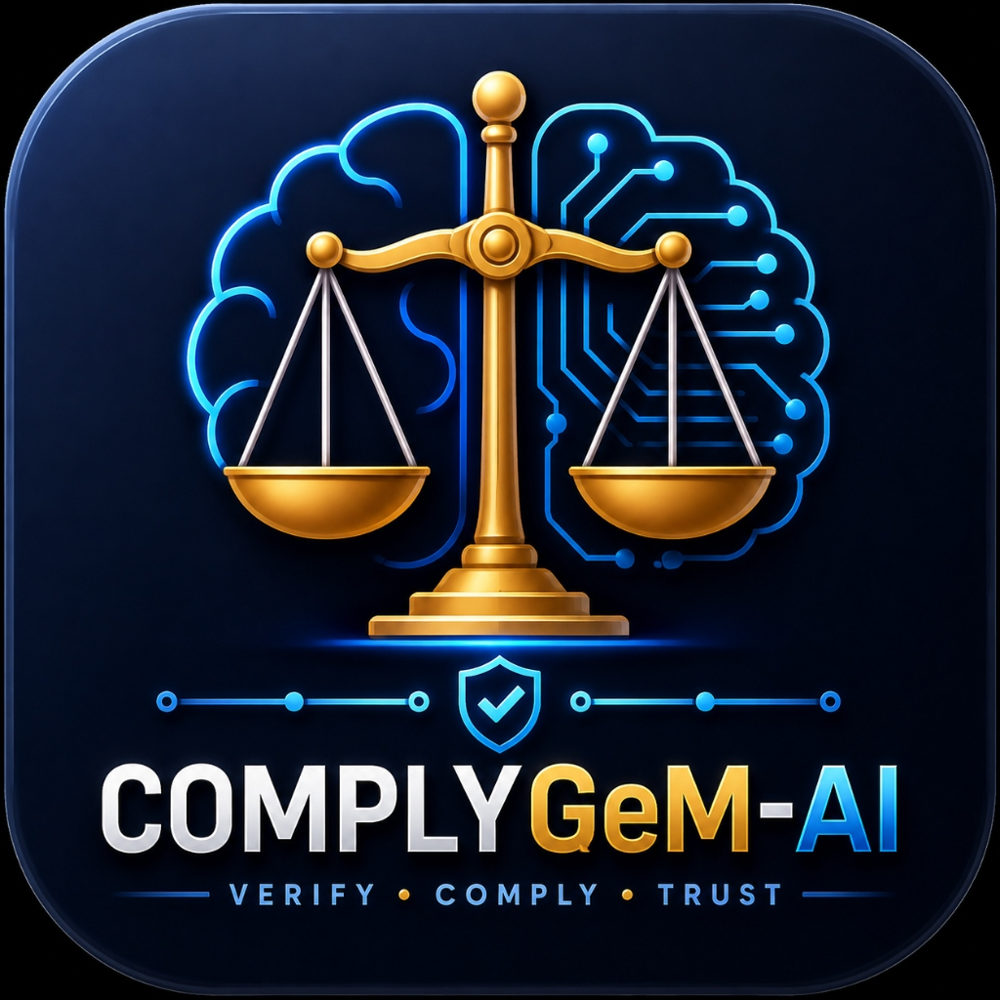
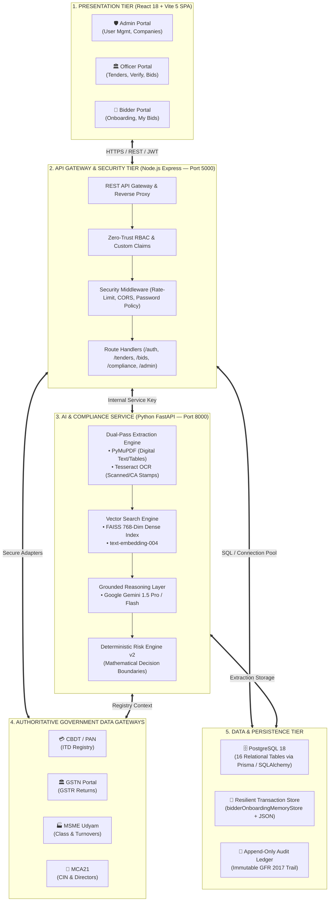
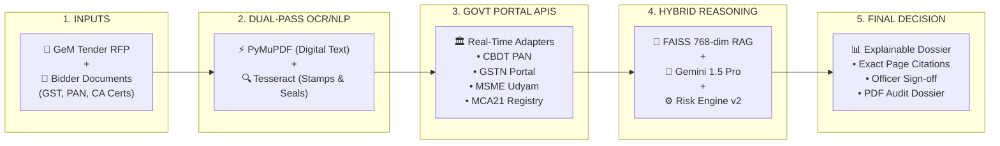
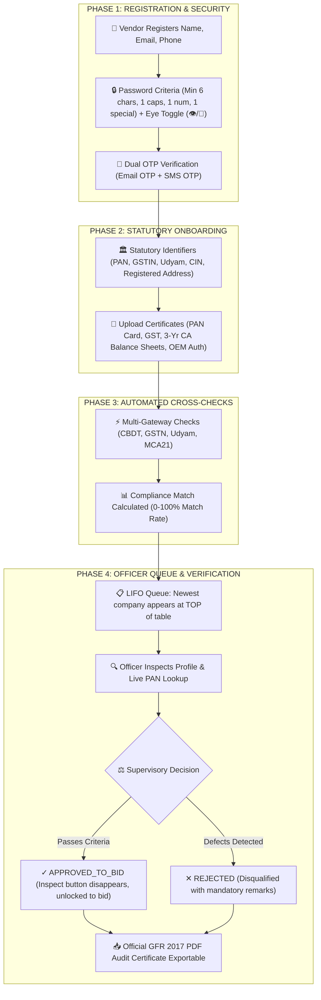

<div align="center">

#  COMPLYGEM-AI
### AI-Powered Integrated Bid Compliance Verification Platform for GeM Procurement

<p align="center">
  
</p>

[](https://react.dev/)
[](https://fastapi.tiangolo.com/)
[](https://expressjs.com/)
[](https://www.postgresql.org/)
[](https://ai.google.dev/)
[](https://drive.google.com/file/d/1xMndcX6KonrEeBUFsQzmoAtvNU76YQNz/view?usp=sharing)

<p align="center">
  <strong>An enterprise-grade, explainable compliance verification platform that automates tender clause extraction, validates bidder evidence across authoritative government gateways (GST, PAN, Udyam, MCA), and delivers auditable human-in-the-loop decision dossiers.</strong>
</p>

<p align="center">
  <a href="https://drive.google.com/file/d/1xMndcX6KonrEeBUFsQzmoAtvNU76YQNz/view?usp=sharing" target="_blank">
    
  </a>
</p>

</div>

---

## 📌 Problem Statement

### **SIH26100 — AI-Powered Integrated Bid Compliance Verification Platform for GeM Procurement**

In public procurement on the **Government e-Marketplace (GeM)**, procurement officers must verify complex bidder eligibility criteria across 50+ page tender specifications and heterogeneous submitted PDFs. Today, this process suffers from systemic bottlenecks:

```
Tender Specifications (50+ Pages)
               │
               ▼
Bidder Submissions (GST, Balances, OEM Certs, PAN)
               │
               ▼
Manual Scrutiny Across Disparate Portals (GSTN, ITD, Udyam, MCA21)
               │
               ▼
High Risk of Overlooked Discrepancies & Fraudulent Submissions
```

1. **Information Silos**: Verifying a single bidder requires logging into separate, disconnected government portals (GSTN, Income Tax, Udyam MSME, MCA21).
2. **Turnover & Clause Mismatches**: Unintentional or fraudulent discrepancies (e.g., audited 3-year turnover deficits or expired OEM authorization) are frequently missed during manual scans.
3. **Black-Box AI Hallucinations**: Generic AI models produce unsupported claims without referencing specific document pages or clauses.
4. **Lack of Auditability**: Manual evaluations lack a tamper-proof digital log of who approved what, when, and based on which document excerpt.

---

## 🗺️ System Architecture

ComplyGeM AI is engineered as a secure, decoupled, multi-tier microservice architecture:



---

## ⚡ The 5-Stage Verification Pipeline



1. **Multi-Source Inputs**: Ingests RFP tender documents, financial criteria, and vendor submissions.
2. **Dual-Pass Extraction Engine**:
   * *Digital Layer*: Streams native text and financial tables via `PyMuPDF` in sub-300ms.
   * *Scanned Layer*: Triggers `Tesseract OCR` only for physical stamps, CA signatures, and scanned balance sheets.
3. **Statutory Registry Gateways**: Verifies existence, status, and legal classification across CBDT (PAN), GSTN (GST), MSME (Udyam), and MCA21 (CIN).
4. **Hybrid Reasoning & Dense Vector RAG**: Maps tender conditions to bidder clauses via FAISS 768-dim embeddings (`text-embedding-004`) while deterministic mathematical rule engines compute financial thresholds (*Zero Decision Autonomy*).
5. **Human-in-the-Loop Evaluation Dossier**: Delivers a single-page compliance dossier with verbatim clause citations, page numbers, and 1-click supervisory **Approve / Reject** actions.

---

## 👥 The 3 Platform Roles & Dedicated Portals

ComplyGeM AI is structured around **3 core procurement personas**:

| Capabilities & Actions | 🛡️ System Administrator | 🏛️ Procurement Officer | 🏢 Bidder / Supplier |
| :--- | :---: | :---: | :---: |
| **Create & Publish Tenders** | ❌ | ✅ | ❌ |
| **Inspect & Verify Company Profiles** | View Only | ✅ (Approve / Reject) | ❌ |
| **Verify Bid Compliance & Evidence** | View Only | ✅ (Sign-off & Score) | ❌ |
| **Live PAN / GST / Udyam Registry Lookup** | View Only | ✅ | ❌ |
| **Approve / Reject Government Staff Accounts** | ✅ | ❌ | ❌ |
| **Provision GeM Officer Accounts** | ✅ | ❌ | ❌ |
| **Download Official Statutory PDF Dossiers** | ✅ | ✅ | ❌ |
| **Browse Tenders & Submit Bids** | ❌ | ❌ | ✅ |
| **Upload Company Certificates (GST/PAN/CA)** | ❌ | ❌ | ✅ |
| **Track Bid Application Status** | ❌ | ❌ | ✅ |

---

## 🔄 Company Registration & Onboarding Lifecycle Flow



---

## 🗄️ Database Architecture (PostgreSQL 18 & Prisma)

The relational schema comprises **16 tables** managed through Prisma ORM and SQLAlchemy models:

```
USER ──────────────► TENDER ──────────► REQUIREMENT
 │                      │                      │
 ├─► BIDDER_PROFILE     ├─► BIDDER ────────────┼─► COMPLIANCE_ITEM
 │    │                 │    │                 │      │
 │    ├─► COMPANY       │    ├─► DOCUMENT ─────┘      └─► COMPLIANCE_REVIEW
 │    ├─► DOCUMENTS     │    │    └─► CHUNKS (FAISS 768-dim)
 │    └─► GOVT_VERIF    │    ├─► VERIFICATION_RESULT
 │                      │    └─► COMPLIANCE_REPORT
 └─► AUDIT_LOG ◄────────┴────────────────────────────── (GFR 2017 Ledger)
```

### Table Specifications:
* **`User`**: System accounts (`ADMIN`, `PROCUREMENT_OFFICER`, `BIDDER`), Firebase UID, password hashes, approval status.
* **`Tender`**: Tender reference numbers, department, estimated value, submission deadlines.
* **`Requirement`**: Extracted criteria clauses, operators (`>=`, `<=`), financial turnover caps, source page numbers.
* **`Bidder`**: Tender-specific vendor submissions.
* **`Document` & `DocumentChunk`**: Uploaded evidence PDFs, page-level text, and dense vector embeddings (`text-embedding-004`).
* **`VerificationResult`**: External registry outputs from CBDT, GSTN, Udyam, and MCA21.
* **`ComplianceItem`**: Clause-by-clause evaluation, similarity score, evidence text excerpt, and page citations.
* **`ComplianceReport`**: Final overall compliance percentage (0–100%) and risk categorization.
* **`BidderProfile` & `BidderCompany`**: Master enterprise directory, statutory identifiers (PAN, GSTIN, CIN, Udyam), registered office address.
* **`AuditLog`**: Append-only cryptographic log recording every user action, verification query, and override.

---

## 📊 Feasibility & Viability Analysis

### The 6 Feasibility Pillars
1. **Technical Feasibility**: Built on battle-tested technologies (`PyMuPDF`, `Tesseract OCR`, `FAISS`, `FastAPI`, `Node.js`, `PostgreSQL 18`).
2. **Economic Feasibility**: Slashes technical scrutiny time by **80%** (from 3–14 days to under 2 minutes), delivering massive cost savings across Central Public Sector Enterprises (CPSEs).
3. **Social Feasibility**: Standardized, objective verification protects legitimate MSMEs and startups from arbitrary human bias and corruption.
4. **Legal & Compliance Feasibility (GFR 2017)**: Fully adheres to Indian General Financial Rules. Enforces **Zero Decision Autonomy**: the AI assists and cites, while the human Procurement Officer retains legal authority.
5. **Operational Feasibility**: Clean, human-built interface with zero learning curve, eliminating portal hopping across 4 different government websites.
6. **Security Feasibility**: Read-only integration with government portals, TLS 1.3 encryption in transit, AES-256 at rest, and an append-only audit trail.

### Real-World Risks vs. Technical Solutions:
| Real-World Challenge | Technical Strategy in ComplyGeM AI |
| :--- | :--- |
| **API Access & Rate Limits** | Phased caching architecture with transactional memory store fallback (`complygem_db.json`) during portal downtime. |
| **Cross-Portal Name Mismatch** | AI reconciliation layer with **Fuzzy Matching (Token Set Ratio & Jaro-Winkler)** normalizes legal suffixes (e.g. 'Pvt Ltd' vs 'Private Limited'). |
| **AI False Positives / Hallucinations** | **Ground-Truth Citations**: Every finding links to exact document page numbers and verbatim excerpts. AI cannot issue unilateral pass/fail decisions. |
| **Officer Adoption Resistance** | Clean, restrained government UI without black-box AI buzzwords; officers maintain 100% supervisory authority. |

---

## 🔑 Live Prototype Test Credentials

Evaluate and test the working prototype using these pre-configured credentials:

| Role Portal | Portal URL | Demo Email | Password | Primary Workflow |
| :--- | :--- | :--- | :--- | :--- |
| **🛡️ System Administrator** | `/admin/dashboard` | `admin@complygem.gov.in` | `Admin@123456` | User provisioning, inspecting registered companies, downloading PDF reports. |
| **🏛️ Procurement Officer** | `/procurement/dashboard` | `officer@complygem.gov.in` | `Admin@123456` | Reviewing newest profiles at top of queue, live PAN lookups, verifying bids. |
| **🏢 Bidder / Supplier** | `/bidder/dashboard` | `vendor@abcindustries.com` | `Admin@123456` | Browsing tenders, submitting bid documents, tracking live compliance status. |

---

## 💻 Running the Full Stack Locally

### Prerequisites
* **Node.js**: v18.0 or higher
* **Python**: v3.10 or higher
* **PostgreSQL**: v16, v17, or v18 running locally or on cloud
* **Git**: Installed and configured

### Step 1: Start the AI Service (FastAPI)
```bash
cd ai-service
python -m venv venv

# Windows:
.\venv\Scripts\activate
# Linux / macOS:
source venv/bin/activate

pip install -r requirements.txt
python -m uvicorn app.main:app --reload --port 8000
```
* Interactive API Documentation: **`http://localhost:8000/docs`**

### Step 2: Start the Backend Gateway (Node.js Express)
```bash
cd backend
npm install
npm run dev
```
* Backend Gateway: **`http://localhost:5000`**

### Step 3: Start the Frontend UI (React + Vite)
```bash
cd frontend
npm install
npm run dev
```
* Web Application: **`http://localhost:5173`**

---

## 👥 Authors & Team

Developed for **Smart India Hackathon (SIH26100)**:
* **Project**: ComplyGeM AI (AI-Powered Integrated Bid Compliance Verification Platform for GeM)
* **Repository**: [https://github.com/suhas9090/SIH-2026](https://github.com/suhas9090/SIH-2026)
* **Presentation Deck (PPT)**: [Google Drive Presentation Link](https://drive.google.com/file/d/1xMndcX6KonrEeBUFsQzmoAtvNU76YQNz/view?usp=sharing)

---

## 📄 License

Distributed under the **MIT License**. See `LICENSE` for details.

<div align="center">
  <sub>Built with security, transparency, and explainability for government procurement.</sub>
</div>
